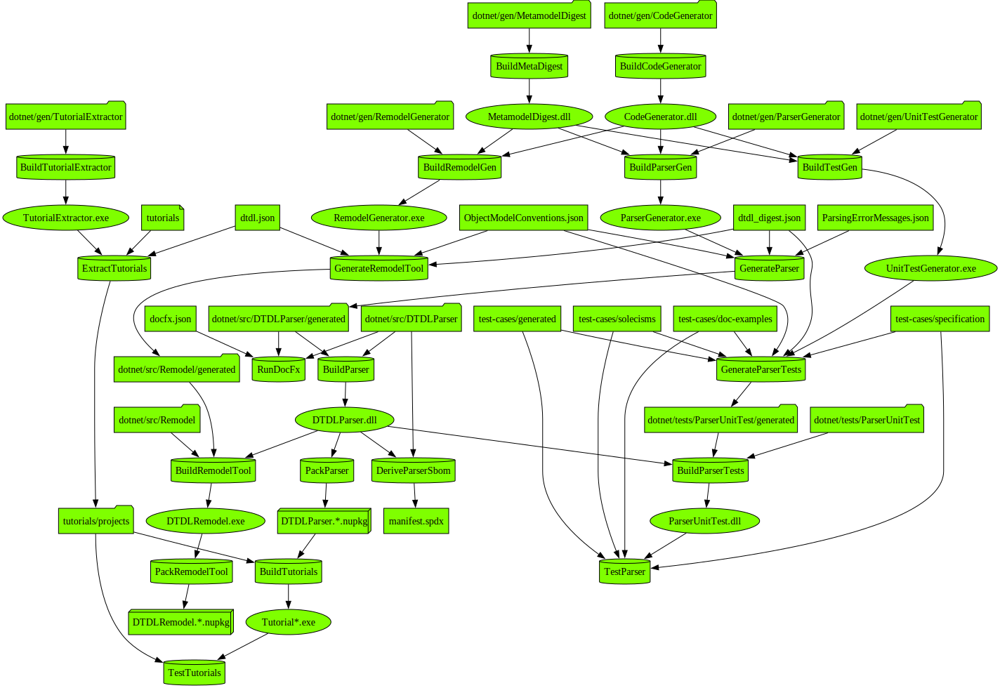

# Contributing Detailed

This file contains information on making changes to this repository via changes to generation code.
Refer to [CONTRIBUTING](CONTRIBUTING.md) for basic  information on the repository [folder structure](CONTRIBUTING.md#folder-structure) as well as instructions on [building the projects](CONTRIBUTING.md#building-the-projects).
Changes to generation code are not permitted via PRs from forks of this repository.

The present repository does not accept direct changes to the DTDL language definition.
It accepts changes to the codebase that are intended either to support new metalanguage features used by the DTDL definition or to enhance aspects of the DTDL parser that are independent of the language, such as software architecture, documentation, and portions of the parser API.

When changes are made to the DTDL repository, automated Azure Pipelines create pull requests on the present repository that propagate changes to the declarative specification of DTDL.
This repository invokes pipelines that code-generate the DTDL parser to conform to the declarative language definition received from the DTDL repository.

Files in the following folders are imported from the DTDL repository:

* :file_folder: **dtdl**
* :file_folder: **test-cases**

User-initiated pull requests to this repository are not permitted to include changes to files in the above folders.
If a PR includes any such changes, the main branch PR pipeline will revert the disallowed changes via an automated commit to the PR branch.

## Files in this repository

There are three broad categories of files:

1. Handwritten code and documents, including code-generation code, non-code-genned portions of the parser, tutorial documents, and various supporting projects.
    * These files are modified via PRs created by users.
2. Declarative files imported from the DTDL repo, including DTDL language definition files, test cases, error messages, and object model conventions.
    * These files are updated via synchronization PRs from the DTDL repository main branch.
3. Generated code and projects, including most of the parser codebase, unit-test sequencers, and tutorial projects.
    * These files are updated as needed by the Parser-PR pipeline in response to either a user PR or a sync PR.
    This automated update may be short-circuited by including the modified files directly in a PR.

## Development flow

The following diagram illustrates the overall development flow, starting at the top with declaration files and source code, and ending at the bottom with NuGet packages and validation tests.
This same flow is followed by the [pipelines](#pipelines) and by the [Develop.sh](CONTRIBUTING.md#building-the-projects) script.
The nodes and edges in this graph are automatically extracted from the script files in the repo using the `FlowTracer` program.

Shape key:

## Pipelines

There are two automated pipelines that operate on this repository.

### Parser-PR

* Triggered by PR to main branch; PRs are blocked from merging until this pipeline completes successfully.
* Codegens parser code; builds and tests parser.
* Validates correctness of change with respect to DTDL definition using test cases from the DTDL repository.
* If needed, adds a commit to PR branch with missing changes to generated files.
* Reverts changes to DTDL files in user PRs but not in sync PRs from the DTDL repository.

### Parser-CI

* Triggered by merge to main branch.
* Codegens parser code; builds and tests parser.
* Validates correctness of code with respect to DTDL definition.
* Validates that code-generated files match the generated files stored in main branch; raises a warning if mismatch.

## Advanced code change sequence

Following is a typical sequence of operations performed by a user and by the pipelines to implement a modification.

1. User creates a PR branch on the user's local clone of the repository.
2. User modifies code and/or other resource files in the branch.
3. User employs `Develop.sh` script to codegen source files, build projects, execute tests, and generate documentation.
4. User adds modified files to PR branch, commits, and submits PR to main branch.
5. Parser-PR pipeline validates change:
    * Executes codegen/build/tests.
    * Employs DTDL artifacts that have been synced from DTDL repo.
6. Parser-PR pipeline modifies PR branch if needed:
    * Reverts any changes to DTDL files (language definition files, test cases, etc. ).
    * Codegens files and adds to PR branch.
7. User completes merge of PR into repository main branch.
8. Parser-CI pipeline validates merge:
    * Executes codegen/build/tests.
    * Validates correctness of artifacts.
    * Validates that artifacts in repository match artifacts generated by pipeline (and warns on mismatch).
