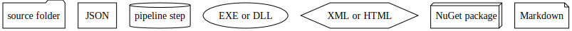

# Contributing Detailed

This file contains information on making changes to this repository via changes to generation code.
Refer to [CONTRIBUTING](CONTRIBUTING.md) for basic  information on the repository [folder structure](CONTRIBUTING.md#folder-structure) as well as instructions on [building the projects](CONTRIBUTING.md#building-the-projects).
Changes to generation code are not permitted via PRs from forks of this repository.

The present repository does not accept direct changes to the DTDL language definition.
It accepts changes to the codebase that are intended either to support new metalanguage features used by the DTDL definition or to enhance aspects of the DTDL parser that are independent of the language, such as software architecture, documentation, and portions of the parser API.

When changes are made to the DTDL repository, automated Azure Pipelines create pull requests on the present repository that propagate changes to the declarative specification of DTDL.
This repository invokes pipelines that code-generate the DTDL parser to conform to the declarative language definition received from the DTDL repository.

Files in the following folders are imported from the DTDL repository:

* :file_folder: **dtdl**
* :file_folder: **test-cases**

User-initiated pull requests to this repository are not permitted to include changes to files in the above folders.
If a PR includes any such changes, the main branch PR pipeline will revert the disallowed changes via an automated commit to the PR branch.

## Persistent Branches

There are two long-term branches in this repository: "main" and "vNext".

### Branch "main"

The main branch is the target for all user PRs.
It contains three broad categories of files:

1. Handwritten code and documents, including code-generation code, non-code-genned portions of the parser, sample documents, and various supporting projects.
    * These files are modified via PRs created by users.
2. Declarative files for the current version of DTDL imported from the DTDL repo, including DTDL language definition files, test cases, error messages, and object model conventions.
    * These files are updated via synchronization PRs from the DTDL repository main branch.
3. Generated code and projects for the current version of DTDL, including most of the parser codebase, unit-test sequencers, and sample projects.
    * These files are updated as needed by the Parser-PR pipeline in response to either a user PR or a sync PR.
    This automated update may be short-circuited by including the modified files directly in a PR.

### Branch "vNext"

The vNext branch is a shadow of the main branch.
Users should never merge changes into this branch, either directly or via PR.
It is kept in sync with main via an automated pipeline.
This branch contains:

1. Copies of handwritten code and documents from the main branch.
    * These files are copied from the main branch via the Parser-vNext-shadow pipeline.
2. Declarative files for the next version of DTDL imported from the DTDL repo.
    * These files are updated via sync PRs from the DTDL repository vNext branch.
3. Generated code and projects for the next version of DTDL.
    * These files are updated by the Parser-vNext-shadow pipeline when it copies in handwritten files from the main branch.
    * These files are also updated by sync PRs from the DTDL repository's vNext branch.
    When the DTDL repository pipeline creates the PR, it is responsible for codegen using handwritten sources residing in the parser repo's main branch and vNext declarations being imported from the DTDL repository.

The vNext branch does not maintain an independent commit history.
It advances via a snap to the main branch followed by a single commit that includes vNext generated files.
When the pipelines are quiescent, the vNext branch is exactly one commit ahead of the main branch.

## Development flow

The following diagram illustrates the overall development flow, starting at the top with declaration files and source code, and ending at the bottom with NuGet packages and validation tests.
This same flow is followed by the [pipelines](#pipelines) and by the [Develop.sh](CONTRIBUTING.md#building-the-projects) script.
The nodes and edges in this graph are automatically extracted from the script files in the repo using the `FlowTracer` program.

Shape key:

## Pipelines

There are three automated pipelines that operate on this repository.

### Parser-PR

* Triggered by PR to main branch; PRs are blocked from merging until this pipeline completes successfully.
* Codegens parser code; builds and tests parser for both current and next versions of DTDL.
* Validates correctness of change with respect to both current and next versions of DTDL, but using only current-version test cases.
* If needed, adds a commit to PR branch with missing changes to generated files for current version of DTDL.

### Parser-CI

* Triggered by merge to main branch.
* Codegens parser code; builds and tests parser for current version of DTDL.
* Validates correctness of code with respect to current version of DTDL.
* Validates that code-generated files match the generated files stored in main branch; raises a warning if mismatch.

### Parser-vNext-shadow

* Triggered by completion of Parser-CI pipeline.
* Codegens parser code; builds and tests parser for next version of DTDL.
* Validates correctness of code with respect to next version of DTDL.
* Updates vNext branch to match main branch but for vNext configuration.

The following diagram illustrates the relationship among the "main" and "vNext" branches of this repo, the three pipelines described above, two types of automated sync PRs from the DTDL repository (from its "main" and "vNext" branches, respectively), and user PRs that modify handwritten code and documents:

The Parser-PR pipeline runs on all PRs to the main branch, but it reverts changes to DTDL files only in user PRs, not in sync PRs from the DTDL repository.

## Advanced Code Change Sequence

Following is a typical sequence of operations performed by a user and by the pipelines to implement a modification.

1. User creates a PR branch on the user's local clone of the repository.
2. User modifies code and/or other resource files in the branch.
3. User employs `Develop.sh` script to codegen source files, build projects, execute tests, and generate documentation.
4. User adds modified files to PR branch, commits, and submits PR to main branch.
5. Parser-PR pipeline validates change:
    * Executes codegen/build/tests for current and next configurations.
    * Employs DTDL artifacts that have been synced from DTDL repo.
6. Parser-PR pipeline modifies PR branch if needed:
    * Reverts any changes to DTDL files (language definition files, test cases, etc. ).
    * Codegens files and adds to PR branch.
7. User completes merge of PR into repository main branch.
8. Parser-CI pipeline validates merge:
    * Executes codegen/build/tests for current configuration.
    * Validates correctness of current-version artifacts.
    * Validates that current artifacts in repository match artifacts generated by pipeline (and warns on mismatch).
9. Completion of Parser-CI pipeline triggers Parser-vNext-shadow pipeline, which:
    * Updates repository vNext branch to match main branch but for vNext configuration.
    * Executes codegen/build/tests for next configuration.
    * Validates correctness of next-version artifacts.

<!-- LINKS -->
[contributing]: CONTRIBUTING.md
